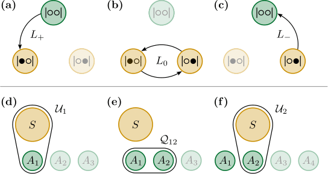

#### Coarse-graining and Generalized Langevin Equations out of equilibrium

Dynamical processes involving a large number of microscopic degrees of freedom are very often effectively described through a restricted sets of relevant observables that describe the system on a coarse scale, either because microscopic degrees of freedom  are not accessible or resolved, or because the detailes of their dynamics is no important. Deriving equations of motion governing such observables is a chalenge that have kept physicists busy for more than a century, and a systematic approach for equilibrum processes has been introduced in the 1960's by Zwanzig, Mori and others using projection operator techniques. The general mathematical structure of such equations is known as the Generalized Langevin Equation and combines three contributions, namely a time-local drif term, a memory term that accouts for the past history and a fluctuating force, whose auo-correlation function is proportionally related to the memory kernel. Although its original derivation was introduced for equilibrum processes, we showed that it can be extended to processes arbitrarily far from equilibrium. In addition, we show how the various contributions of the equation can be evaluated numerically from experimental or numerical timeseries. Details available here: <https://doi.org/10.1063/1.5006980>, <https://doi.org/10.1063/1.5090450>, <https://doi.org/10.1063/1.5090450>, <https://doi.org/10.1002/adts.202000197>.

#### Approximating weak-memory dynamics

While a great variety of natural processes are described by equations with memory, finding solutions of such equations is usually a hard task. Instead, one may want to come up with accurate approximations of the true solutions. A broad range of methods have been introduced but ofte suffer from the inconveninence of being either too system specific or based on uncontrolled assumptions. For processes where mmory effcts play an important role but are subdominant, a systematic way of deriving faithful approximations that are the solutions of time-local equations converging to Markovian processes. This formalism and the method t rigoroulsy construct such approximations can be derived not only in continuous time but also for processs described by a discrete time variable. Details are available here: <https://doi.org/10.1103/PhysRevLett.134.037101>, <https://arxiv.org/abs/2510.26325> 

::: {.column-margin}

:::

