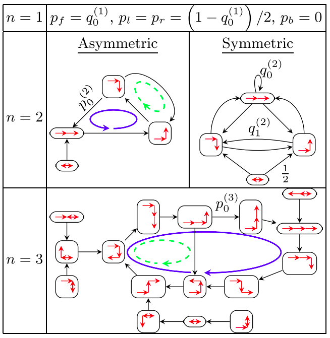
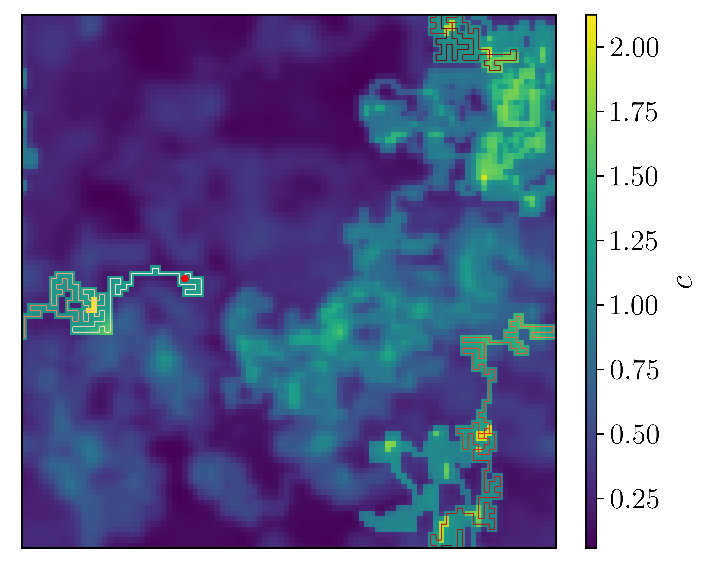
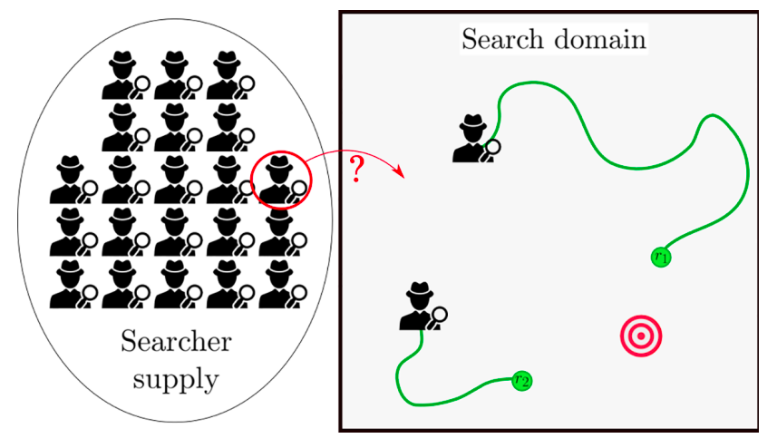

Search processes are ubiquituous in nature. From immune cells looking for pathogens to eliminate, to foraging ants in search, situations where agents need to find a target as quickly as possible are encountered across many length and time scales. As a statistical physicist, I am interested in the general mechanisms that make a search process efficient and what levers can be pulled in order to improve it.

#### Explicit memory
If the searcher can remember its previous path over the past few steps, can it design an efficient strategy t explore space as efficiently as possible? Using a discrete time and space setting, we showed that not only explicitly remembering the past steps can indeed be very useful, but also that remembering only a very few numbers of steps in the past is sufficient to dramatically improve the search efficiency, if this information is used appropriately. Details available here: <https://doi.org/10.1103/PhysRevLett.127.070601>

::: {.column-margin}

:::

 
 
 
 

#### Auto-chemotactic search
Chemotaxis is the ability for particles and organisms to guide their motion using chemical information. For example, bacteria may need to migrate towards regions of high nutrient concentration in order to survive and therefore orient their motion along concentration gradients. Conversely, organisms may be sens an ffective repulsion from certain chemical species that they need to avoid. Auto-chemotaxis refers to processes where the chemical cue is itself produced by the organism that later senses it. Auto-chemorepulsion constitutes an effective search strategy as the cue left along the searcher’s path acts as an effective memory of previously visited locations that one tried to avoid. Both the interaction strength with the cue as well as the decay and diffusion of the cue can be optimally tuned to reach spectacularly high collective search efficiencies approaching a perfect search. This results from a combination of three effects: (i) the searchers can be homogeneously spread acros a search domain thanks to the effective repulsive interactionmediated by the self-produced concentration fields, (ii) the self-interaction of each seracher with its own field allows it to be persistent, a necessary requirement for efficient search strategies, (iii) individual concentration fields act as memory shared by all searchers. Details available here: <https://arxiv.org/abs/2409.04262>

::: {.column-margin}

:::

#### Optimal launching

While adding more agents into a collective search process will almost inevitably reduce the overall search time, it may however come a a certain cost. Whether searchers are immune cells looking for pathogens, or human gents in a search-and-rescue mission, producing (or hiring) a searcher and sustaining it requires resources. Accounting for these in an overall search cost function, not only the number of agents can be optimized but also the timing with which they should be launched into the process. In fact, if the probability for the target to still be alive decays quickly, it can be shown that searchers should be launched at increasingly longer time intervals. However, if this survival probability decays slowly, searchers should in th long run be launched at a constant pace. Details available here: <https://doi.org/10.1103/PhysRevE.111.064112>

::: {.column-margin}

:::